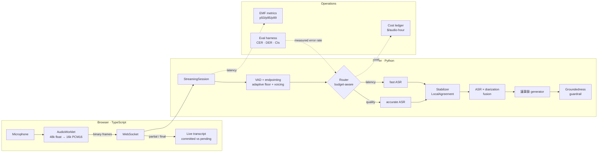

# koe（声）— a bilingual voice-AI harness

**Japanese/English voice AI, assembled.** Streaming ASR, speaker diarization and
an LLM writing 議事録 (meeting minutes), orchestrated behind one plugin kernel and
held to explicit **latency, cost and quality budgets**.

English · [日本語](README.ja.md)

[](https://github.com/jon-jc/koe-harness/actions/workflows/ci.yml)


---

## The problem this is about

A voice product is never one model. It is an ASR model, a diarization model, an
LLM, and a lot of glue. The hard part is not any single model — it is the
**assembly**:

- Which backend should serve *this* request, given that live captions and an
  overnight archive job want opposite trade-offs?
- What happens when a vendor is slow, wrong, or down mid-meeting?
- How do you know a change made the product better rather than just different?
- What does an hour of audio actually cost, and which model is responsible?

koe answers those four questions as running code.

---

## What it does, concretely

```bash
pip install -e ".[dev,api,cli,ja]"
koe minutes            # transcript → 議事録, with verification shown
```

```
─── 1. transcript (ASR × diarization) ───
田中: 本日の議題は第三四半期の売上レビューです。
鈴木: 売上は前年比で百二十パーセント、目標を達成しました。
佐藤: はい、金曜日までに対応します。

─── 2. 議事録 ───
# 第三四半期 売上レビュー
**出席者**: 佐藤、田中、鈴木

## 決定事項
- 新機能のリリースは3月10日とする

## アクションアイテム
- [ ] KPIダッシュボードを更新する — 担当: 佐藤 / 期限: 金曜日

─── 3. verification ───
groundedness: 2/2 claims supported (100%)
repairs: 1
dropped 1 unsupported claim(s):
  - 来月中に全社展開を完了する        ← nobody said this. caught and removed.
```

That last line is the point of the whole LLM layer. See
[Hallucination detection](#hallucination-detection-that-is-a-string-operation).

### The chat is a harness

Not a chat box with tools bolted on. `src/koe/harness/` is a port of the parts
of [DeepSeek Harness](https://github.com/deepseek-ai/deepseek-harness) (MIT)
that make the difference, reimplemented in Python against koe's kernel — see
[THIRD_PARTY_NOTICES.md](THIRD_PARTY_NOTICES.md) for exactly what was taken.

**A conversation is an append-only log, and the message history is derived from
it.** Not a mutated list. That one change is what makes the rest possible: the
pending queue is a fold over the same log, cancellation has somewhere to record
the prefix the user actually saw, and *what did the model see on step 3* has an
answer.

**You can steer a turn instead of cancelling it.** A model three tool calls into
the wrong file does not need to be stopped and re-prompted — it needs telling,
while it works, that it is looking in the wrong place. Type while it is running
and **Send** becomes **Steer**: the correction lands at the next step boundary
and the turn keeps the work it has already done.

**Tool calls run in parallel where the tool says that is safe.** A read is
parallel-safe; a shell command is not, and is a barrier. Dispatch overlaps but
results commit in *model order* — a read that finishes first still lands after
the calls the model listed before it, so the derived history does not depend on
disk timing and a provider's prefix cache stays usable.

**Cancelling leaves a well-formed history.** Streamed text is committed as
interrupted, because the next request has to contain what the user actually saw.
Calls that never dispatched get a synthetic `aborted before dispatch` result,
because an assistant turn containing a call with no result is a request vendors
reject — the next turn would fail on the history rather than on the
cancellation.


**Long conversations compact instead of failing.** A meeting chat runs out of
context window eventually, and the provider's answer to that is a refused
request. koe's answer is dsh's: at 80% of the window, replace the earliest part
of the conversation with a summary of it — keeping the most recent 16% verbatim,
because that is what the next answer depends on.

Compaction **shadows rather than deletes**: the summary is appended and the
range it stands for is marked, so both are still in the log and *what was
compacted away* has an answer. The replacement lands at the position of the
range it replaces, not at the end, or a summary of the beginning would appear
after the middle. And a cut is only legal where no unanswered tool call crosses
it — cutting elsewhere produces an assistant turn whose calls are answered by
results the request no longer contains, which every vendor rejects.

Pruning is tried first because it is free: the middle of an oversized tool
result is replaced with a marker, no model involved. A 40,000-character file
read is rarely needed in full three turns later, and removing its middle often
relieves the pressure without spending a request.

> The token meter is a heuristic, and it counts scripts separately on purpose.
> English runs about four characters per token; Japanese is closer to *one*,
> because most kanji are their own token. A `len // 4` estimator prices a
> Japanese transcript **4.6× too low** — measured — so a harness using one would
> sail past the context limit believing it had room.

```
turn/start → step/start → assistant/message → tool/call ×3 → tool/result ×3
           → step/end   → step/start → assistant/message → step/end → turn/end
```

Every one of those is an event in the log, and the panel renders them as
structure rather than prose.

### Telling a sentence from a door

An energy detector cannot. A door closing is a rise above the room that lasts
long enough to clear any minimum duration, so it opens an utterance, goes to a
recognizer, and comes back as a confident transcription of a door — a line in
the transcript that reads exactly like something a person said. In a meeting
room the loud non-speech is constant: a chair, a laptop lid, a keyboard, paper.

So koe also asks whether the sound has the *structure* of a voice. Voiced
speech repeats at 70–350 Hz and its energy sits below 1 kHz; a thud, a click
and a hiss do none of that. An utterance has to **contain voicing** — not every
frame, because /s/ is speech too, but somewhere.

```bash
koe vad-bench          # eight room conditions, with the control column
```

| | energy only | **+ voicing** |
|---|---|---|
| precision | 0.716 | **0.954** |
| recall | 0.998 | **0.998** |
| F1 | 0.834 | **0.976** |
| false alarms per minute | 3.50 | **0.00** |
| utterances merged with a noise | 2 | **0** |
| onset error | −796 ms | **−84 ms** |

Recall is unchanged, which is the number that matters most: a detector that
rejects noise by also rejecting quiet speakers has not improved. It costs about
1.3× the CPU and still runs 200× faster than realtime, because the expensive
measurement is *sampled* rather than run on every frame — see
[`features.py`](src/koe/pipeline/features.py).

Two details that took measuring to find. A naive periodicity score is really a
*smoothness* score, so 50 Hz mains hum rates 0.71 and a low thump 0.89, and both
read as speech; requiring the correlation peak to be an interior local maximum
rejects them outright. And one voiced frame is not evidence — a decaying thump
produced exactly one in its quiet tail and that admitted the whole door. Three
frames is a vowel; one is a coincidence.


**The prompt describes the harness that exists.** It used to be a constant that
told the model it could run shell commands whether or not the terminal plugin
was loaded — wrong in both directions, and quietly. Sections are now
contributions with disposers, like tool registrations, so unloading a plugin
takes its instructions with it. Ordering is by centrally allocated slot with a
name tie-break, because a prompt whose bytes depend on plugin load order
invalidates a provider's prefix cache on a run that changed nothing.

**Slash commands go to the harness, not the model.** `/compact` is not a request
for the model to summarize — it is an instruction to run a compaction
transaction, and sending it to the model would produce a polite reply and no
compaction.

```
/compact    Summarize the earlier conversation to free context.
/context    Show how much of the context window is in use.
/clear      Start a new conversation.
/stop       Stop the running turn.
/help       List the commands.
```

Failure messages say what happened *to the conversation* — unchanged, changed,
or recorded in the log — because "it didn't work" is useless to someone deciding
whether their conversation is intact.


**The composition is declarative.** Plugins were mounted in Python, so a koe
without the terminal, or with compaction tuned for a smaller window, was a fork.
A profile is an ordered list of rows, and patch layers address rows *by id* with
last-write-wins — koe ships a base, a deployment adds a patch, a user adds
another, and none of them has to know what the others contain.

```toml
# ~/.config/koe/profile.toml
[[plugins]]
id = "terminal"
disabled = true

[[plugins]]
id = "user-vocabulary"
[plugins.config]
path = "/etc/koe/vocabulary.txt"
```

A patch replaces a row's whole `config` rather than merging into it. Merging
means someone who sets one field inherits every other field from a layer they
cannot see, so the effective configuration is a computation nobody has written
down. And a row naming a plugin this build does not have is *reported*, not
fatal: a profile written for a koe with an extra plugin should still start the
koe you have, minus that plugin.

### Running entirely on your own machine

koe works with no API key and no account. Settings → Local.

**Language models.** Start Ollama, LM Studio, llama.cpp's server, vLLM or Jan
and koe finds it — it probes the ports those projects ship with, concurrently,
at startup. There is nothing to configure, because the machine already knows
which models it has:

```
Ollama  ·  on this device
  qwen2.5:7b     7.6B · Q4_K_M
  llama3.2:3b    3.2B · Q4_K_M
```

A configured API key still wins by default, because pasting one is a
preference and a server listening on 11434 is not. **Prefer local** inverts
that, which is the switch to use if you would rather not have to delete your
credentials to stop them being used.

**Speech recognition.** Turn on local recognition and audio never leaves the
device — the reason koe can be pointed at a confidential meeting at all. It
runs [faster-whisper](https://github.com/SYSTRAN/faster-whisper) in-process:

```bash
pip install 'koe-harness[asr]'
```

The size list is not a neutral speed slider, and koe does not present it as
one. Whisper's training mix is overwhelmingly English, and the small
checkpoints spend what multilingual capacity they have on languages close to
it — so `tiny` and `base` produce English that is rough but usable and Japanese
that is not. Those are marked **not suitable for Japanese** rather than left
for you to discover from a meeting transcript. `large-v3-turbo` is the default:
within a point or two of `large-v3` on Japanese at a third of the compute.

Local backends join the router rather than replacing it. Local inference is
free and slow; a hosted vendor is quick and metered; which one a given request
should use is exactly the trade the router exists to make. So the providers
declare their disadvantages honestly — a zero-cost backend with no
counterweight would win every routing decision, and koe would feel broken
rather than free.

> The per-language error rates for the Whisper sizes and for local LLMs are
> **priors, not measurements** — `ProviderInfo.measured` is `False` until the
> eval harness has run against a given backend on your hardware.

### The vocabulary

Every recognizer is wrong about the same class of word: the ones specific to the
people using it. Colleagues' names, the product, the internal acronym. No amount
of provider-switching fixes that, because the information is not in any model.

Settings → Vocabulary is a plain text list, stored at `vocabulary.txt` in the
config directory so it can live in a dotfiles repository:

```
山本
経営会議 => 取締役会
KPI
```

A line with an arrow corrects the transcript; a line without one registers a
term to bias the recognizer toward. Matching changes strategy by script — Latin
terms match at word boundaries so a rule for "koe" does not fire inside
"invoke", and Japanese terms match as substrings, because `\b` is defined on
`\w` and there is no boundary between two kanji for it to find.

---

## Architecture



Right tool per layer, rather than one language everywhere:

| Layer | Stack | Why |
|---|---|---|
| Kernel, ASR/diarization, router, eval, LLM orchestration | **Python 3.11+** | Where the AI ecosystem, provider SDKs and eval statistics live |
| Realtime client — capture, resampling, streaming, live UI | **TypeScript** | `AudioWorklet` has no Python equivalent; browser audio belongs in the browser |
| Serving | **FastAPI + WebSocket** | Streaming-first, async throughout |
| Infra | **Docker + Terraform** (ECS Fargate) | Reproducible, boring, deployable |

---

## Four design positions

### 1. Japanese is a design constraint, not a locale string

This is the part most bilingual pipelines get wrong, and it does not fail
loudly — it produces numbers that look fine and mean nothing.

**WER is close to meaningless for Japanese.** The language has no word spaces,
so "words" only exist relative to a segmenter. Two teams reporting 12% WER on
the same audio with different tokenizers have not measured the same thing. koe
scores Japanese with **CER**, and every WER it reports carries the name of the
tokenizer that produced it.

**Normalization has two profiles, deliberately separated.** Scoring
normalization is aggressive and lossy; display normalization is conservative.
Conflate them and you either measure formatting instead of recognition, or strip
the 。and 、 that make Japanese readable:

```python
normalize_for_scoring("本日は、ＫＰＩを確認します。")  # → 本日はkpiを確認します
normalize_for_display("本日は、ＫＰＩを確認します。")  # → 本日は、KPIを確認します。
```

**Whitespace handling is language-aware.** Japanese has no word spaces, so any
the ASR inserted are arbitrary and must go — but English spaces are load-bearing.
A naive `.replace(" ", "")` turns `hello world` into `helloworld`:

```
その KPI を review します  →  そのkpiをreviewします
hello world               →  hello world
```

**漢数字 conversion is gated on morphology.** `一般` (general), `一緒`
(together) and `十分` (sufficient) all begin with numeral kanji and none are
numbers. Converting them yields `1般`, which is worse than doing nothing, and no
character-level rule can tell the difference — so conversion uses MeCab POS tags
and falls back to a conservative stoplist when MeCab is absent.

**Endpointing is tuned per language.** Japanese speakers pause before
sentence-final particles and politeness endings (〜ですね, 〜ますので). An
English-tuned endpointer cuts there and removes the verb — which in Japanese is
where negation and tense live. JA gets 900 ms of silence tolerance, EN gets 650.

### 2. Model choice is a runtime decision

Backends register as services carrying their cost, speed and expected quality as
data. A request declares a budget; the router filters on hard constraints, then
ranks what survives:

```python
Budget.realtime()   # live captions: <800ms, streaming required
Budget.accurate()   # post-meeting 議事録: no latency cap, best model
Budget.bulk()       # archive re-processing: cost priority, quality floor
```

Hard constraints **eliminate** rather than penalize — a 200 ms cap on live
captions is not a preference a very cheap backend can outweigh by being cheap.
Scores are normalized *within the candidate set*, so when every candidate costs
about the same, cost stops influencing the ranking and quality decides.

**The loop closes with evaluation.** `record_measurement()` replaces a
provider's documented prior with a measured error rate, so routing converges on
reality instead of vendor marketing:

```python
router.select(budget).chosen_name                          # "vendor_a" (prior)
router.record_measurement("vendor_a", Language.JA, 0.22)   # production says otherwise
router.select(budget).chosen_name                          # "vendor_b"
```

### 3. Uncertainty is quantified, not asserted

An error rate on forty utterances is an estimate, not a measurement. Every
number carries a bootstrap confidence interval, and A/B comparisons get a paired
bootstrap plus a paired permutation test:

```
$ koe compare --baseline 0.0 --candidate 0.12
delta            +10.24%   CI [+8.48%, +12.11%]   p=0.0005  →  REGRESSION

$ koe compare --baseline 0.10 --candidate 0.105
delta            -0.61%    CI [-3.02%, +1.74%]    p=0.6742  →  INCONCLUSIVE
```

Resampling happens at the **utterance** level, never the character level —
errors within an utterance are strongly correlated, and treating characters as
independent would understate variance badly and produce intervals far too narrow
to be honest.

**Regression gates fail only on significant regressions.** A gate that fires on
run-to-run noise gets re-run until green and then ignored, so a difference that
cannot be distinguished from noise is a warning, not a build failure.

**Slicing is where the findings are.** A corpus-level CER averages away the
thing you can act on:

| slice | n | CER |
|---|---|---|
| overall | 41 | 8.40% |
| tag:monolingual | 32 | 7.83% |
| **tag:code-switch** | 9 | **10.59%** |
| lang:ja | 28 | 10.20% |
| lang:en | 13 | 6.42% |

### 4. Hallucination detection that is a string operation

<a name="hallucination-detection-that-is-a-string-operation"></a>

An LLM asked to summarize a meeting will occasionally invent an action item
nobody agreed to, or attach a deadline nobody said — fluently enough that a
reviewer skims past it. In a minutes product, that invented task lands in
someone's backlog with a due date.

So the schema **requires a verbatim `source_quote` on every claim**. That single
constraint turns hallucination detection into a string operation: either the
quote is in the transcript or it isn't. No second model call, no LLM-judge
uncertainty of its own, effectively zero cost.

Matching runs on scoring-normalized text (reusing the layer above), so a model
that copies verbatim but differs in width or punctuation still matches. Support
is scored by longest common substring rather than pass/fail, so a lightly
reworded quote scores ~0.9 and a fabricated one scores near 0 — which lets the
system keep the first and drop the second.

Unsupported claims are **dropped, not flagged**: an action item marked
"unverified" still ends up in a task list, and the reader has no way to check it.

---

## Reliability

| Guarantee | Why it exists |
|---|---|
| Teardown always completes | One failing cleanup never strands its siblings — a leaked socket in one plugin must not leak the rest |
| Children die before parents | A decoder cannot outlive the session owning its audio buffer |
| A crashing subscriber cannot drop audio | Handler failures are isolated per emit |
| Committed captions are never revised | Taking back text a viewer already read is worse than having waited |
| Audio intake never blocks on recognition | Dropping a caller's speech to wait on a slow model is unrecoverable |
| A full server rejects, never queues | A caller queued behind a full server records audio nobody is transcribing |
| Non-retryable errors stop the fallback chain | A malformed request fails identically at the next provider |
| Only retryable failures open a circuit breaker | A bad request says nothing about provider health |
| Production refuses to boot misconfigured | A wildcard CORS policy should stop a deploy, not become an incident |

---

## Quick start

Everything runs on deterministic mocks — **no API keys required**.

```bash
python -m venv .venv && source .venv/bin/activate   # .venv/Scripts/activate on Windows
pip install -e ".[dev,api,cli,ja]"
pytest                                              # 473 tests
```

```bash
koe info                    # which backends are available here
koe minutes                 # 議事録 generation, with the guardrail catching a fabrication
koe evaluate                # score a system, sliced by language and tag
koe compare --baseline 0.0 --candidate 0.12   # A/B with a significance verdict
koe gate                    # CI regression gates; exits non-zero on failure
koe serve                   # API + live web client on :8000
```

Real providers activate when credentials are present:

```bash
pip install -e ".[llm]"          # the vendor SDKs are an optional extra
export KOE_ANTHROPIC_API_KEY=sk-...
koe minutes --live
```

Or paste a key into **Settings** in the running app — it takes effect on the
next request, with no restart. Three properties that panel holds to:

| Rule | Why |
|---|---|
| A stored key is never returned, only a fingerprint (`sk-ant-…9f2c`) | A UI that can read a secret back is one bug away from leaking it |
| The environment wins over the stored key, and the panel refuses to edit it | A deployment injecting secrets must not be overridden by a stale file |
| Saving does not verify; **Test** is a separate button | Verification costs a request, and a save that silently spends money is a surprise |

Keys are encrypted at rest with DPAPI on Windows and obfuscated elsewhere, in
the user config directory — never in the repository. A key whose vendor SDK is
missing from the build keeps the mock in use and says so, rather than reporting
a backend that would fail on first call.

### The live client

```bash
cd web && npm install && npm run build && cd ..
koe serve      # → http://127.0.0.1:8000
```

Microphone audio is downsampled to 16 kHz mono PCM16 in an `AudioWorklet` before
it leaves the browser — ~6× less uplink than 48 kHz float, and off the main
thread so a UI repaint cannot drop input frames. Committed text renders normally
while the tail the model has not settled on is greyed.

#### The workbench

The client is laid out like an editor — Cursor, Codex, VS Code — rather than as
pages, because its panels are views onto one session, not alternatives to each
other. Asking the agent about a transcript should not mean navigating away from
the transcript.

| Region | Holds |
|---|---|
| Activity rail | Session · Explorer · Outline · Harness — what the sidebar shows |
| Centre tabs | The transcript, 議事録 / routing / metrics, and the code viewer |
| Bottom panel | A real terminal (pty), or the plain text the agent sees |
| Agent panel | The harness, always open on the right |
| Status bar | Recording state, context-window pressure, cost, model |

The agent transcript follows Claude Code: one column with a glyph gutter rather
than chat bubbles. `>` is you and `⏺` is the agent; on a tool call the dot's
colour is the call's state — amber running, green returned, red failed — with the
result hung underneath on `⎿` and previewed to three lines. While a turn runs, a
working line shows elapsed time and step, typing *steers* the turn at its next
step boundary, and Esc interrupts. `/` opens command completion.

| Keys | Does |
|---|---|
| `Ctrl+K` | Command palette — matches Japanese and English labels alike |
| `Ctrl+B` / `Ctrl+J` | Toggle the sidebar / the terminal panel |
| `Ctrl+L` | Focus the agent, quoting any selected transcript text |
| `Ctrl+Shift+L` | Toggle the agent panel |
| `Ctrl+1…3` | Switch centre tabs |
| `Space` | Start or stop recording |

Drag a splitter to resize a region (or focus it and use the arrow keys);
double-click it to reset. The layout persists across reloads.

#### Listening to a call, not just a room

Most meetings are not in one room, so **Settings → Audio** offers three sources:

| Source | For |
|---|---|
| Microphone | An in-person meeting, on a chosen input device |
| Screen or window audio | The far side of an online meeting — you pick what to share when recording starts |
| Both, mixed | A hybrid meeting: your voice from the mic, everyone else from the shared audio |

On Windows, audio is only available when sharing an **entire screen or a browser
tab** — a single application window carries none (a Chromium limitation). The
panel says so before you choose, and a share that arrives with no audio track is
refused with that explanation rather than transcribed as silence.

The same panel exposes the interim-result interval and, behind an explicit
opt-out, the two endpointing numbers. The opt-out is deliberate: the silence
window is longer for Japanese than English, and sending a number would overwrite
that, so nothing is sent unless you turn the defaults off. Whatever arrives is
clamped server-side.

### Desktop application

Download `koe-setup-<version>.exe` from
[Releases](https://github.com/jon-jc/koe-harness/releases) and run it. The
install is per-user: no administrator rights, no UAC prompt.

> **Windows will warn you before it runs.** The installer is not code-signed —
> a certificate is a recurring cost this project does not carry — so SmartScreen
> shows *"Windows protected your PC"* and hides the Run button behind
> **More info → Run anyway**. That warning means *"we have not seen this file
> before"*, not *"this file is harmful"*; every unsigned binary from a small
> project gets it. Downloading the same file enough times is what eventually
> clears it, which is no help to the first person.
>
> Check what you downloaded before you click through, and compare it against
> `SHA256SUMS.txt` on the release:
>
> ```powershell
> Get-FileHash .\koe-setup-0.1.0.exe -Algorithm SHA256
> ```

**Prefer not to click through a security warning?** Then don't — there is no
installer in this path:

```bash
pip install -e ".[api,cli,ja,desktop]"
koe-desktop                      # or: python -m koe.desktop
```

Either way it is a native window over the same API the server deployment runs —
nothing is stubbed for desktop, so the two builds cannot drift apart. To build
the installer yourself: `python packaging/build.py --installer` produces a 47 MB
`koe-setup-<version>.exe` and the matching SHA-256.

Requires Windows 10/11 x64 and the Edge WebView2 runtime, which ships with
Windows 11 and updated Windows 10. The installer checks for it and says where to
get it rather than leaving you with a blank window.

pywebview over WebView2 rather than Electron: the client already exists and is
14 KB gzipped, and Windows already has the browser engine — shipping a second
copy of Chromium to run it would add ~150 MB for nothing. See
[docs/desktop.md](docs/desktop.md) for single-instance handling, crash
reporting, and the capability probe.

### Docker

```bash
docker compose -f deploy/docker/docker-compose.yml up --build
```

Multi-stage build, non-root (uid 10001), read-only root filesystem, healthcheck.
Verified locally: **healthy in 2 s with no credentials**, MeCab present, real
WebSocket session produces a transcript.

---

## Project layout

```
src/koe/
  kernel/        Plugin core — scopes, reactive services, event bus
  text/          JA/EN script analysis, normalization, 漢数字, tokenization
  domain/        Audio (hot path, dataclasses) and transcripts (pydantic)
  providers/     ASR / diarization / LLM behind narrow protocols
    llm/         Anthropic + OpenAI adapters
    local/       On-device: server discovery, OpenAI-compatible client, Whisper
  routing/       Budgets, circuit breakers, fallback chains
  evaluation/    CER/WER/DER, VAD scoring, bootstrap CIs, gates, corpus
  pipeline/      VAD, acoustic features, endpointing, stabilization, sessions
  harness/       Session log, inbox, scheduling, turn/step machine, compaction
  minutes/       議事録 schema, prompts, guardrails, generator
  telemetry/     Cost ledger, metrics, structured logging
  api/           FastAPI + WebSocket
  cli/           koe command line
web/src/         TypeScript realtime client
deploy/          Dockerfile, compose, Terraform (ECS Fargate)
```

---

## Testing and CI

917 tests, `mypy --strict` clean, `ruff` clean, `tsc --noEmit` clean.

CI runs eight jobs on every push:

- **lint & types** — ruff lint + format, mypy strict
- **tests** × 4 — Python 3.11/3.12 × with and without MeCab
- **web client** — `tsc --noEmit`, build, and a check that the committed bundle is not stale
- **terraform** — `fmt -check` and `validate`
- **docker** — builds the image and asserts it becomes healthy with no credentials

The MeCab matrix split is deliberate: Japanese tokenization is an optional
dependency, which creates a hazard specific to this project — a dev machine with
MeCab and a runner without it can silently disagree, so a normalization bug
reproduces in one place and not the other. `tests/text/test_backend_parity.py`
pins the contract by forcing each backend explicitly.

CI also smoke-tests the evaluation harness itself: a clean backend must score 0,
and a degraded one must be caught as a significant regression. The harness that
guards quality needs guarding too.

---

## Documentation

| Document | |
|---|---|
| [Architecture](docs/architecture.md) | The decisions where an alternative was seriously considered and rejected, with the reason |
| [Privacy & data handling](SAFETY.md) · [日本語](SAFETY.ja.md) | What touches audio, what is retained, third-party exposure, APPI |
| [Benchmarks](BENCHMARK.md) | How performance is measured, and the numbers |
| [Desktop application](docs/desktop.md) | Packaging, the .exe, and desktop-specific failure modes |
| [Contributing](CONTRIBUTING.md) | Setup, conventions, and what reviewers look for |
| [Third-party notices](THIRD_PARTY_NOTICES.md) | Dependencies and prior art |

---

## Deliberate limitations

Being explicit about what this is and isn't:

- **The default backends are deterministic mocks.** Real adapters exist for
  Anthropic, OpenAI and (via protocol) Whisper/pyannote, but the mocks are what
  CI and the demo run on. That is a feature — it keeps CI free, deterministic,
  and runnable on a clean checkout — but the reported error rates measure the
  *harness*, not any real ASR model.
- **The corpus is 41 synthetic utterances**, hand-written to contain the cases
  that break Japanese pipelines. It validates the machinery; it is not a
  benchmark result. Swapping in real recordings changes the data, not the code.
- **Sessions live in process.** The ALB is configured sticky and scaling is
  horizontal per-task. Cross-instance session migration would need a shared
  store, which this does not have.
- **The speaker mapping in DER is greedy**, not Hungarian. It is exact whenever
  one hypothesis label dominates each reference speaker — the normal case for
  meetings — and near-optimal otherwise.
- **Terraform is validated, not applied.** `fmt` and `validate` run in CI; it has
  not been deployed to a live AWS account.

## Acknowledgements

The plugin kernel's composability model — scoped lifetimes, dependency-gated
activation, spatial filters — is adapted from
[deepseek-harness](https://github.com/deepseek-ai/deepseek-harness) and the
[Cordis](https://cordis.js.org) "everything is a plugin" design, reimplemented in
Python and specialized for a realtime audio domain.

Partial stabilization uses **LocalAgreement**, as described by Macháček et al.
and used in `whisper_streaming`.

Three pieces of the dictation workflow — the spacing rules for scripts that do
not separate words, the ordering that strips reasoning-model scratchpads, and
the user vocabulary — are adapted from
[OpenWhispr](https://github.com/OpenWhispr/openwhispr). See
[THIRD_PARTY_NOTICES.md](THIRD_PARTY_NOTICES.md) for what was taken and where
koe departs from it.

## License

MIT
